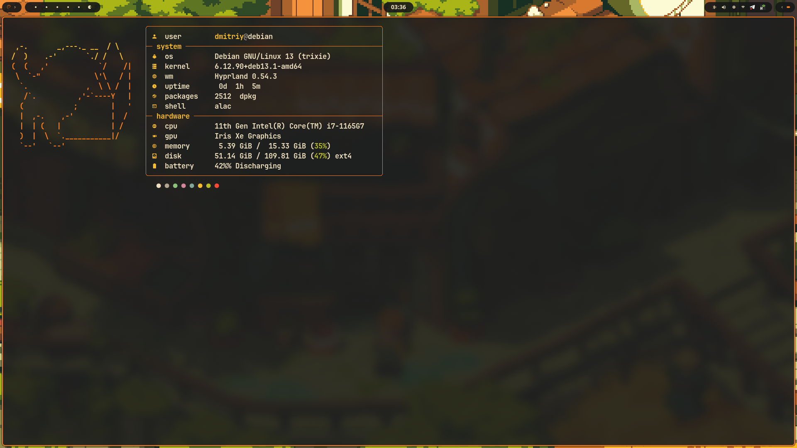
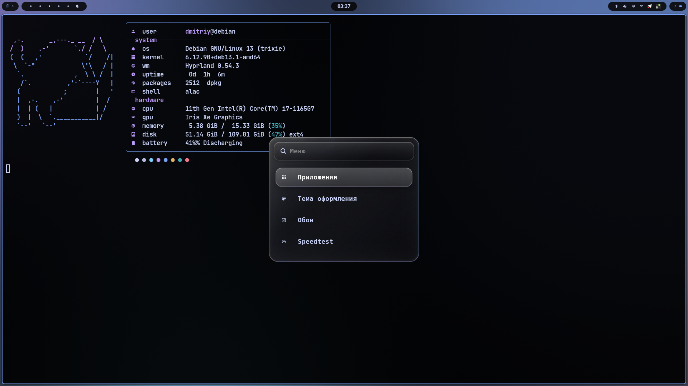
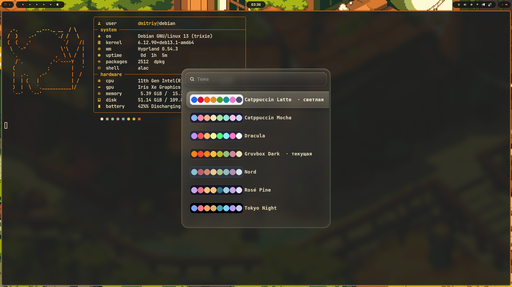
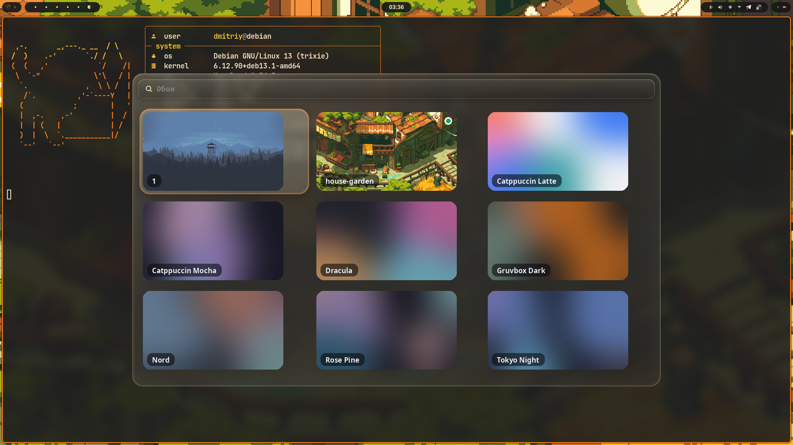
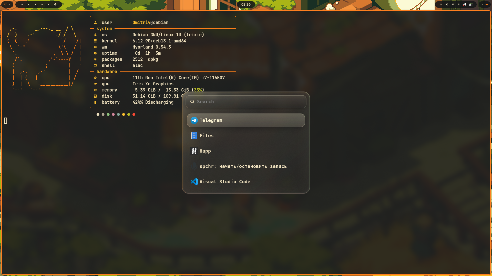
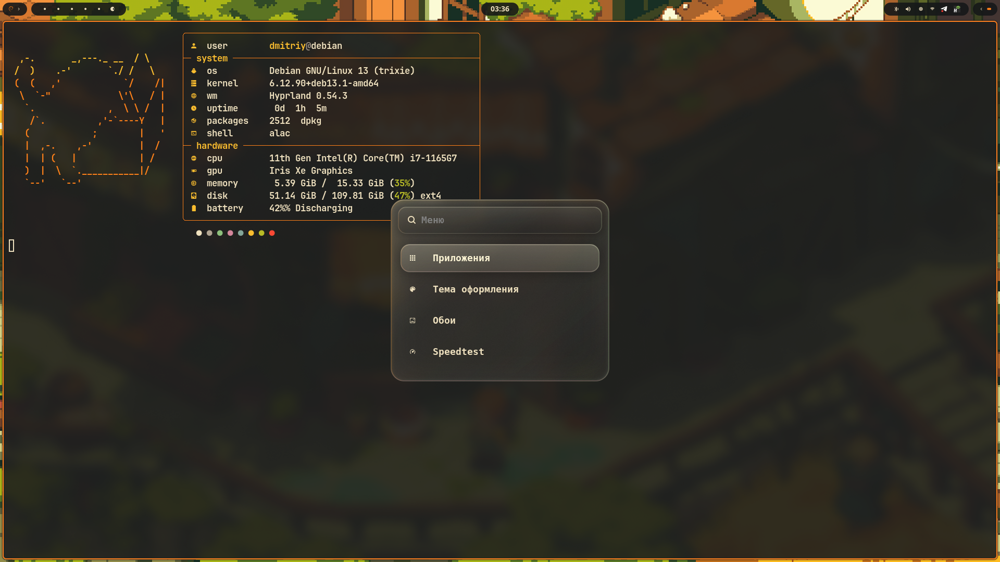
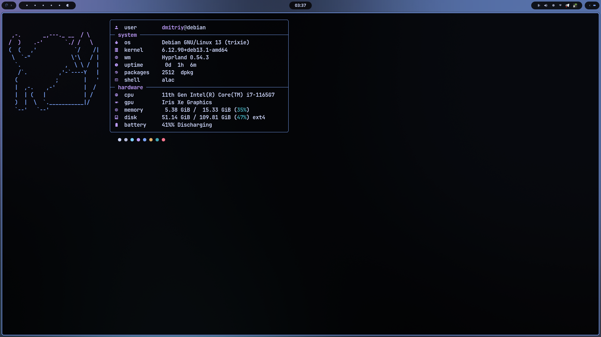

# Chrysalis

> A clean, minimal Hyprland desktop for Debian-based systems — install Debian/Ubuntu, run one script, get a polished setup.






<details>
<summary>More screenshots</summary>





</details>

---

## Features

- **Hyprland** (≥ 0.54) with blur, "liquid glass" layer popups and bounce animations
- **Theme system** — 7 JSON palettes; `theme-apply <id>` recolors *everything* at once:
  Hyprland borders · waybar · swaync · wofi · alacritty · kitty · GTK 3/4 · Qt/KDE (`kdeglobals`) · fastfetch · folder icons (Adwaita recolored to the accent) · `gsettings` dark/light (Firefox & Chromium follow)
- **Contrast boost** — `theme-apply --contrast 0..1` pulls backgrounds toward black/white without touching accents
- **Wallpapers** — mesh-gradient wallpaper generated per theme, picker with thumbnails, animated circular transition (`swww`-style grow, no swww needed)
- **Waybar** — workspaces, mpris, hidden drawers (battery / cpu / load, memory / temp), bluetooth, volume, backlight, network, tray, swaync control center
- **wofi menus** — glass-styled main menu (`Super+Alt+Space`): apps · theme · wallpaper · speedtest
- **Speedtest** — LibreSpeed in a floating, theme-colored terminal
- **Auto-installer** — detects the distro, enables backports/PPA for Hyprland, links configs, generates wallpapers, applies the theme

---

## Quick Start

```bash
git clone https://github.com/TklaSnst/Chrysalis
cd Chrysalis
bash install.sh
```

Use `--dry-run` to preview what will be installed without making changes:

```bash
bash install.sh --dry-run
```

**Supported:** Debian 13 (trixie, Hyprland from backports), Ubuntu 24.04+ (Hyprland PPA), any `apt`-based distro that ships Hyprland ≥ 0.54.

The installer **symlinks** `.config/*` and `.local/bin/*` into your home, so `git pull` updates the live config. Existing directories are backed up as `*.bak`.

---

## Themes

```bash
theme-apply --list          # id  name  mode
theme-apply tokyo-night
theme-apply catppuccin-latte
theme-apply --contrast 0.3  # 0 = palette as-is, 1 = max contrast (default 0.6)
```

| id | name | mode |
|----|------|------|
| `catppuccin-latte` | Catppuccin Latte | light |
| `catppuccin-mocha` | Catppuccin Mocha | dark |
| `dracula` | Dracula | dark |
| `gruvbox-dark` | Gruvbox Dark | dark |
| `nord` | Nord | dark |
| `rose-pine` | Rosé Pine | dark |
| `tokyo-night` | Tokyo Night | dark |

Or use the menu: `Super+Alt+Space` → **Тема оформления**.

### Adding a theme

Drop a JSON file into `.config/themes/` — 23 keys, all hex:

```json
{
  "id": "my-theme", "name": "My Theme", "mode": "dark",
  "bg": "#…", "bg_alt": "#…", "surface": "#…", "surface2": "#…",
  "fg": "#…", "fg_dim": "#…", "fg_bright": "#…",
  "accent": "#…", "accent2": "#…",
  "red": "#…", "orange": "#…", "yellow": "#…", "green": "#…",
  "cyan": "#…", "blue": "#…", "magenta": "#…",
  "black": "#…", "bright_black": "#…", "white": "#…", "bright_white": "#…"
}
```

Then `wallpaper-gen` (creates `wallpapers/theme-my-theme.png`) and `theme-apply my-theme`.

---

## Wallpapers

```bash
wallpaper-set ~/Pictures/photo.png                  # animated transition, random corner
wallpaper-set photo.png --pos center                # top-left | top-right | bottom-left | bottom-right | center | random
wallpaper-gen [--force]                             # (re)generate mesh gradients for every theme
```

The picker (`Super+Alt+Space` → **Обои**) scans `~/.config/wallpapers` and `~/Pictures/Wallpapers`.
A default position for the transition can be stored in `~/.config/wallpapers/transition`.

---

## Keybindings

| Key | Action |
|-----|--------|
| `Super + Return` | Terminal (alacritty) |
| `Super + Space` | App launcher (wofi drun) |
| `Super + Alt + Space` | Main menu (apps / theme / wallpaper / speedtest) |
| `Super + B` | Browser (firefox) |
| `Super + C` | VS Code |
| `Super + V` | DaVinci Resolve |
| `Super + P` | Screenshot area → clipboard |
| `Print` / `Shift + Print` / `Ctrl + Print` | Screenshot area / screen / output → file |
| `Super + Shift + Q` | Close window |
| `Super + Shift + V` | Toggle floating |
| `Super + Shift + F11` | Fullscreen |
| `Super + Shift + P` | Toggle group |
| `Super + J` | Toggle split |
| `Super + Shift + X` | Pin window |
| `Super + S` / `Super + Shift + S` | Scratchpad show / move to |
| `Super + R` | Resize submap (arrows, `Esc` to leave) |
| `Super + Arrows` / `Super + Shift + Arrows` | Focus / move window |
| `Super + 1–0` / `Super + Shift + 1–0` | Switch / move to workspace |
| `Super + Scroll` | Next / previous workspace |
| `Super + Shift + C` | Reload Hyprland |
| `Super + Shift + E` | Exit Hyprland |
| `Caps Lock` | Toggle keyboard layout (us / ru) |
| 3-finger swipe ←→ / ↓ (+Alt) / ↑ (+Super) | Workspace / close / fullscreen |

---

## Structure

```
.
├── install.sh
├── screenshots/
├── .config/
│   ├── hypr/hyprland.conf        # sources theme.conf (generated)
│   ├── waybar/                   # config.jsonc → layouts/with_music.jsonc + modules.jsonc
│   ├── wofi/                     # style.css (glass), style-wallpaper.css, per-menu configs
│   ├── swaync/                   # notification center
│   ├── alacritty/                # alacritty.toml + binds.toml (theme.toml generated)
│   ├── kitty/kitty.conf          # includes theme.conf (generated)
│   ├── fastfetch/logo.txt        # config.jsonc is generated
│   ├── rofi/                     # rofi drun launcher used by the waybar start button
│   ├── themes/*.json             # color palettes
│   └── wallpapers/               # default wallpaper; theme-*.png generated here
└── .local/bin/
    ├── theme-apply               # the theme engine (python, no deps beyond stdlib + GTK)
    ├── wofi-main-menu            # Super+Alt+Space
    ├── wofi-theme                # theme picker with palette swatches
    ├── wofi-wallpaper            # wallpaper grid with thumbnails
    ├── wallpaper-gen             # mesh gradient per theme (Pillow)
    ├── wallpaper-set             # set wallpaper with transition
    ├── wallpaper-transition      # GTK layer-shell circular reveal
    ├── speedtest-menu / -run     # LibreSpeed in a floating alacritty
    └── waybar-autostart          # retry wrapper for waybar at session start
```

---

## How the theme system works

```
themes/<id>.json ──► theme-apply ──► hypr/theme.conf, waybar/colors/colors.css,
                        │            swaync/colors/colors.css, wofi/colors.css,
                        │            alacritty/theme.toml, kitty/theme.conf,
                        │            gtk-3.0/gtk.css, gtk-4.0/gtk.css, kdeglobals,
                        │            fastfetch/config.jsonc, icons/ThemeAccent
                        └──► gsettings color-scheme / gtk-theme / icon-theme
                             hyprctl reload · waybar restart · swaync reload · kitty SIGUSR1
```

Every target is a small function in `theme-apply`; to support a new app add one that writes its file and append it to the tuple in `main()`. Generated files carry a header and are git-ignored.

---

## Dependencies

Installed automatically by `install.sh`:

| Package | Purpose |
|---------|---------|
| `hyprland` ≥ 0.54, `xdg-desktop-portal-hyprland/-gtk` | Compositor & portals |
| `waybar` | Status bar |
| `wofi` | Launcher & menus |
| `rofi` | drun launcher for the waybar start button |
| `sway-notification-center` | Notifications / control center |
| `swaybg` | Wallpaper |
| `alacritty` (`kitty` optional) | Terminal |
| `fastfetch`, `librespeed-cli` | Shown from the terminal / menu |
| `grim` + `slurp` + `grimshot` + `wl-clipboard` | Screenshots |
| `playerctl`, `brightnessctl`, `pulseaudio-utils` | Media / hardware keys |
| `pipewire` + `wireplumber` | Audio |
| `network-manager-gnome`, `blueman` | Applets |
| `python3-pil`, `python3-gi`, `gir1.2-gtklayershell-0.1` | Theme engine, thumbnails, wallpaper transition |
| Nerd Fonts (CaskaydiaCove, JetBrainsMono) | Icons in waybar / wofi / swaync (downloaded on request) |
